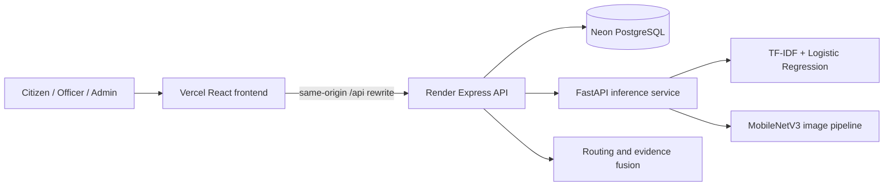

# JanSamadhan

### AI-assisted civic complaint triage for the Lucknow pilot area


JanSamadhan is a full-stack academic prototype that helps a citizen describe a
civic problem, attach a photograph, mark its location, and receive an
explainable routing suggestion. It combines multilingual text classification,
selective image classification, duplicate detection, explicit jurisdiction
rules, and a role-based complaint workflow.

The system is deliberately conservative. A photo can support the complaint,
but text and jurisdiction rules decide the municipal route. Low-confidence,
conflicting, mixed-ownership, or unsupported cases are sent to a manual-review
queue.

> **Scope:** Lucknow academic pilot. This application does not submit reports
> to Lucknow Municipal Corporation, Jal Kal, PWD, NHAI, LDA, or another public
> authority.

## What the application demonstrates

- Citizen registration, sign-in, report submission, image upload, location
  capture, status tracking, and complaint history
- Officer queues, status transitions, priority changes, and administrator
  reassignment
- English, Hindi, and Hinglish text classification for six civic categories
- Eight-class civic-scene image classification with confidence and review
  thresholds
- Text + photo evidence fusion with human-readable reasons
- Location-, time-, category-, and TF-IDF-based duplicate suggestions
- Lucknow-specific proposed department routing and jurisdiction safeguards
- Neon PostgreSQL persistence for users, reports, histories, and images
- Evidence pages showing real datasets, splits, metrics, confusion matrices,
  limitations, and source attribution

## System architecture



The Render deployment runs Express and FastAPI in one container. Express owns
authentication, validation, complaint workflow, storage, and the public API.
FastAPI loads the trained text and image models. Vercel serves the Vite build
and forwards `/api` requests to Render so the session cookie remains on the
frontend origin.

## Model behavior

### Text model

The text pipeline uses word and character TF-IDF features with balanced
Logistic Regression classifiers. It predicts:

- **Category:** Garbage, Road Damage, Streetlight, Water Supply, Sewerage, or
  Other/manual review
- **Priority:** Low, Medium, or High

The model was trained on 34,470 text examples. The split is group-aware, so
English, Hindi, and Hinglish translations of the same complaint stay in one
split.

| Split | Rows |
|---|---:|
| Train | 25,136 |
| Validation | 4,677 |
| Test | 4,657 |

| Target | Test accuracy | Test macro F1 |
|---|---:|---:|
| Category | 77.09% | 69.09% |
| Priority | 76.40% | 68.33% |

The metrics above are raw model results from
[`data/model_metrics.json`](data/model_metrics.json). Safety phrases can raise
priority, and jurisdiction guards can route a prediction to manual review.

### Image model

The promoted `image-v4-road` pipeline uses an ImageNet-pretrained
MobileNetV3-Small base classifier and a road specialist. It recognizes scene
evidence for garbage/litter, potholes, road-surface issues, waterlogging,
streetlight infrastructure, traffic signs, road scenes, and unsupported
scenes.

| Evaluation | Result |
|---|---:|
| Test images | 1,651 |
| Eight-class test accuracy | 81.34% |
| Eight-class test macro F1 | 86.81% |
| High-confidence selective precision | 94.29% |
| High-confidence coverage | 10.60% |
| Road-specialist best epoch | 7 of 10 |

Selective precision covers only predictions that pass the documented
confidence and margin thresholds. The remaining photos are still displayed as
suggestions but require review. Full per-class results are in
[`data/image_pipeline_metrics.json`](data/image_pipeline_metrics.json).

### How text and photo are combined

Both inputs are used when a citizen provides both:

1. Text predicts the complaint category and priority.
2. The photo predicts a civic scene and a confidence score.
3. The fusion policy checks whether the two signals agree and whether the
   image class is eligible to affect routing.
4. Strong agreement can support the text result. A strong conflict, weak
   image, infrastructure-only image, or unsupported scene triggers manual
   review.
5. Text and explicit ownership rules remain authoritative for department
   routing because an image cannot establish road ownership, exact location,
   or responsible authority.

The same fusion function is used for preview and final submission in
[`backend/evidence.js`](backend/evidence.js).

## Dataset provenance

The text corpus begins with 11,200 CivicComp-HiEn source records and 33,600
language slots derived from Bengaluru/BBMP complaints. After conflict removal,
grouping, filtering, and global normalized deduplication, 31,014 external text
examples remain. Another 3,456 deterministic Lucknow vocabulary examples are
added only to the training split.

The image model uses carefully filtered public research sources including
RDD2022 India, SpotGarbage GINI, TACO, Roadway Flooding, an urban streetlight
collection, and traffic-sign scene data. Raw downloaded image corpora are not
committed to Git. Download scripts, manifests, licenses, audit notes, promoted
weights, and metrics are included.

Read the complete cards and caveats:

- [Text dataset card](data/DATA_CARD.md)
- [Image model review](docs/IMAGE_MODEL_REVIEW.md)
- [Text and image assessment](docs/TEXT_IMAGE_ASSESSMENT.md)
- [Image credits](docs/IMAGE_CREDITS.md)

## Proposed Lucknow routing

| Complaint | Proposed first queue | Officer role |
|---|---|---|
| Garbage, sweeping, municipal open-drain cleaning | LMC Sanitation / Health | Zonal Sanitary Officer or Sanitary Inspector |
| Municipal road damage | LMC Engineering | Junior Engineer, then Executive Engineer |
| Public streetlight | LMC street-lighting engineering desk | Responsible lighting engineer through control room |
| Municipal water supply | Jal Kal | Executive Engineer for the relevant zone |
| Sewer line or manhole | Jal Kal sewerage desk | Zonal engineering desk / designated operator |
| Mixed ownership or unsupported issue | Manual jurisdiction review | Demo grievance triage officer |

Roads may instead belong to PWD, NHAI, LDA, a private society, or another
authority. Open drains and sewers may also have different owners. The
application therefore asks an officer to confirm zone and asset ownership.
The verified general LMC control-room entry used by the prototype is shown in
the application directory; no current named official is asserted.

## Run locally on Windows

### Prerequisites

- Node.js 20 or newer
- Python 3.11
- PowerShell
- A Neon PostgreSQL connection string, or local JSON storage for a temporary
  demo

### One-command setup

```powershell
cd "E:\OneDrive\Documents\ChatGPT\JANSAMADHAN"
.\SETUP.cmd
```

Copy `.env.example` to `.env` and put your own Neon connection string in
`DATABASE_URL`. Then start the demo:

```powershell
.\START_DEMO.cmd
```

Open [http://127.0.0.1:3001](http://127.0.0.1:3001). The launcher starts the
FastAPI model service on port 8001, the Express API on port 3001, and the Vite
development server used during frontend work.

You can also run:

```powershell
npm run dev
```

### Demo accounts

All demo accounts use password `Review@123`.

| Role | Email |
|---|---|
| Citizen | `citizen@demo.in` |
| Administrator | `admin@demo.in` |
| Department officer | `sanitation@demo.in`, `roads@demo.in`, `lighting@demo.in`, `water@demo.in`, `sewerage@demo.in`, or `review@demo.in` |

These accounts are created only when the selected data store has no users.

## Tests

```powershell
npm test
& ".\.venv\Scripts\python.exe" -m unittest discover -s tests -p "test_*.py"
npm run build
```

The JavaScript suite covers API authentication, report workflow, image upload,
duplicate behavior, and evidence fusion. The Python suite covers text
prediction, image validation, image-pipeline behavior, and metric artifacts.

## Deployment

The repository contains:

- [`Dockerfile`](Dockerfile) — reproducible Node + Python production image
- [`render.yaml`](render.yaml) — Render Blueprint for the API/model service
- `vercel.json` — Vercel build and API rewrite configuration after the
  Render service URL is assigned
- [`.env.example`](.env.example) — variable names without credentials

The only required production secret is `DATABASE_URL`. Never commit the real
value. See [the deployment guide](docs/DEPLOYMENT.md) for the complete release
and verification procedure.

## Repository map

```text
backend/             Express API, auth, storage, evidence fusion
frontend/            React pages and CSS
ml/                  FastAPI service, training code, promoted checkpoints
data/                cards, derived text corpus, manifests, final metrics
docs/                evaluation, model, review, and deployment notes
scripts/             acquisition, preparation, training, and launch tools
tests/               JavaScript and Python verification suites
Dockerfile           production container
render.yaml           Render infrastructure definition
```

## Responsible-use limits

- This is an academic routing assistant, not an official grievance channel.
- The training text is Bengaluru-derived; it does not prove Lucknow accuracy.
- Some categories, especially sewerage, have little real test support.
- Image predictions describe visible scenes and do not prove a fault,
  ownership, location, or urgency.
- Uploaded reports can contain personal information. A public deployment needs
  a privacy notice, retention policy, stronger identity controls, monitoring,
  backups, and an authorized municipal integration before real operational use.

The project exposes its uncertainty instead of silently treating every model
output as a correct municipal decision.
